# Hackintosh-Gigabyte-AERO-17SA-Ventura

## 设备配置
- 型号：Gigabyte AERO-17SA
- 生产日期：2019-08
- CPU：Intel i7-9750H (12) @ 2.60GHz
- GPU1：Intel UHD Graphics 630
- GPU2：NVIDIA GTX 1660Ti (已屏蔽)
- 无线网卡：Intel Killer AX1650
- 有线网卡：Intel Killer Ethernet E2600
- 存储：INTEL SSDPEKKW512G8

## 目前存在的问题
- ~~开机3分钟暗屏(添加过 **-igfxblt** 和 **-igfxbls** 参数,无效)~~ 
(**已解决**)
- ~~蓝牙模块芯片组依旧提示 **THIRD_PARTY_DONGLE** 
怀疑蓝牙可以启动但无法连接~~ (芯片组显示正常)
- USB接口无法显示但可以读取到U盘信息也可以正常访问 (有待考证)
- ~~雷电接口 **可能** 无法使用~~ (**可以使用**)
- 和NVIDIA 芯片组相连的一个USB接口和一个雷电接口 **永久** 无法使用 
(除非你让macos开发者重新支持NVIDIA芯片)
- 似乎不支持指纹识别登录？
- AERO-17SA自带读卡器,确认无法识别
- (*2024年5月1日 添加*) 暂不支持睿频(最高只到2.6GHz)
- (*2024年5月1日 添加*) facetime可以丝滑玩耍
- (*2024年5月1日 添加*) 已支持Killer E2600板载网卡(EFI早晨起来更新)

## 未测试
- ~~AERO-17SA自带读卡器~~
- (*2024年4月23日 新添加*) 蓝牙连接情况
- ~~有线网卡~~
- ~~雷电接口~~

## 奇奇怪怪(不确定)的特性
- 似乎支持升级sonoma？(若更新sonoma系统,需要修改网卡驱动来适配sonoma系统  
*在kext文件夹中已经支持,将其激活即可*)
- Elan触摸板完美支持,可在 **系统设置>触摸板>光标与点按>轻点来点按** 
中进行设置从而支持点击
- (*2024年5月1日 删除*)~~似乎支持CPU睿频？~~
- (*2024年4月23日 新添加*) 丝滑地调整亮度
- (*2024年5月1日 删除*)~~摄像头可以使用,但不知道facetime是否支持~~

## 配图
*neofetch:*
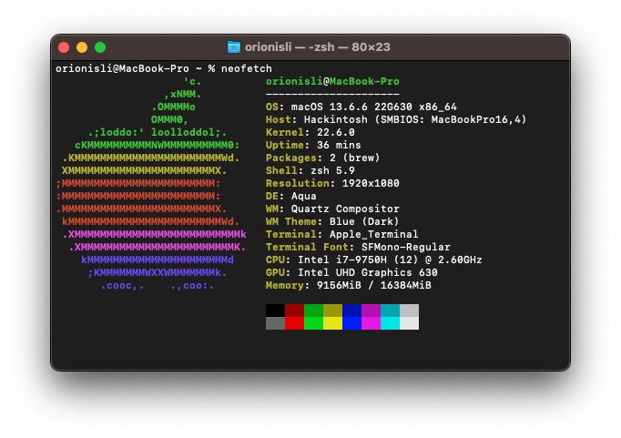

*information:*
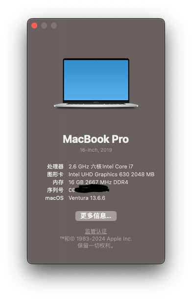 

*hardware:*
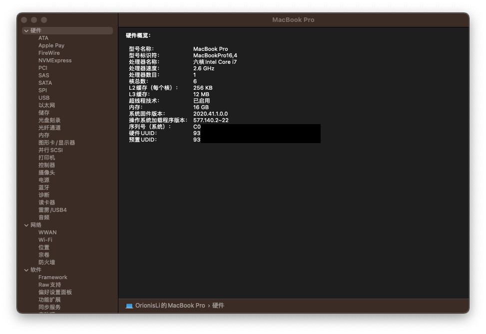

*storage:*
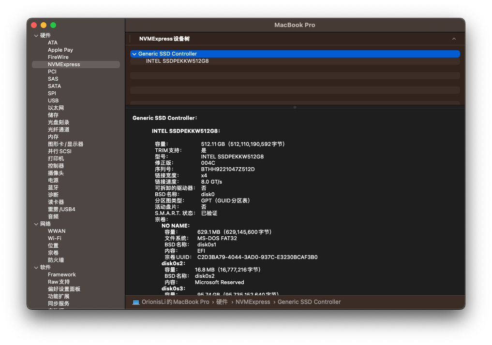

*usb:*
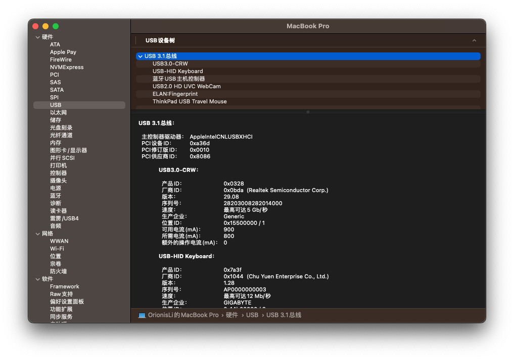

*ram:*
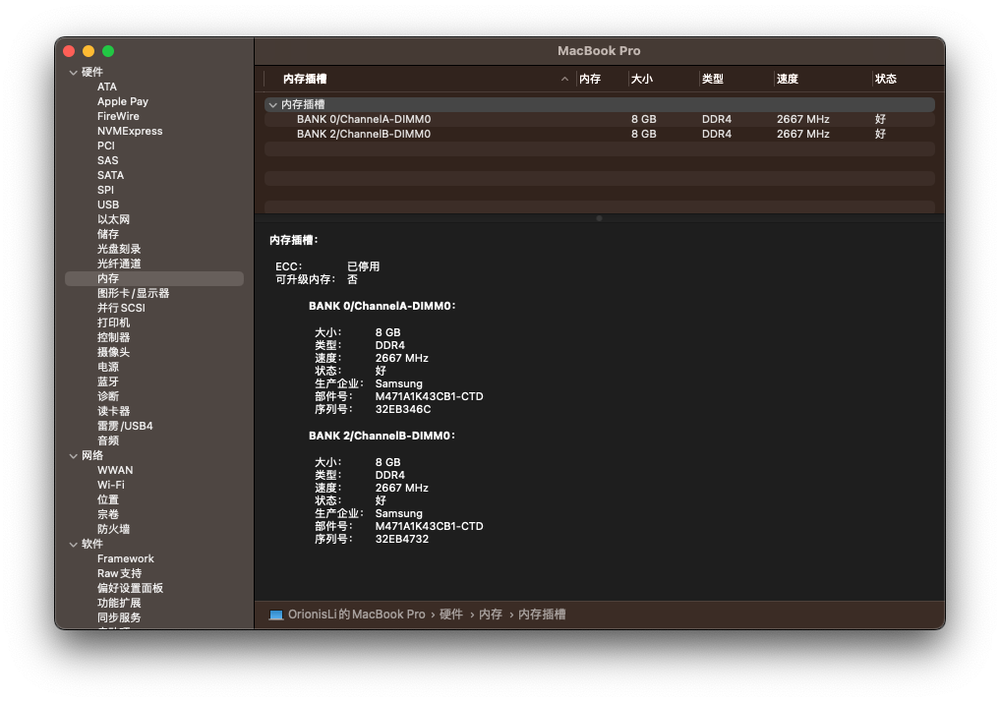

*graphics:*
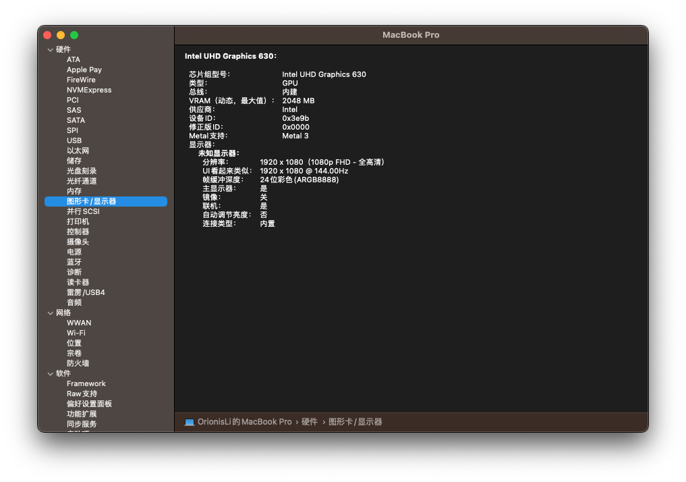

*camera:*
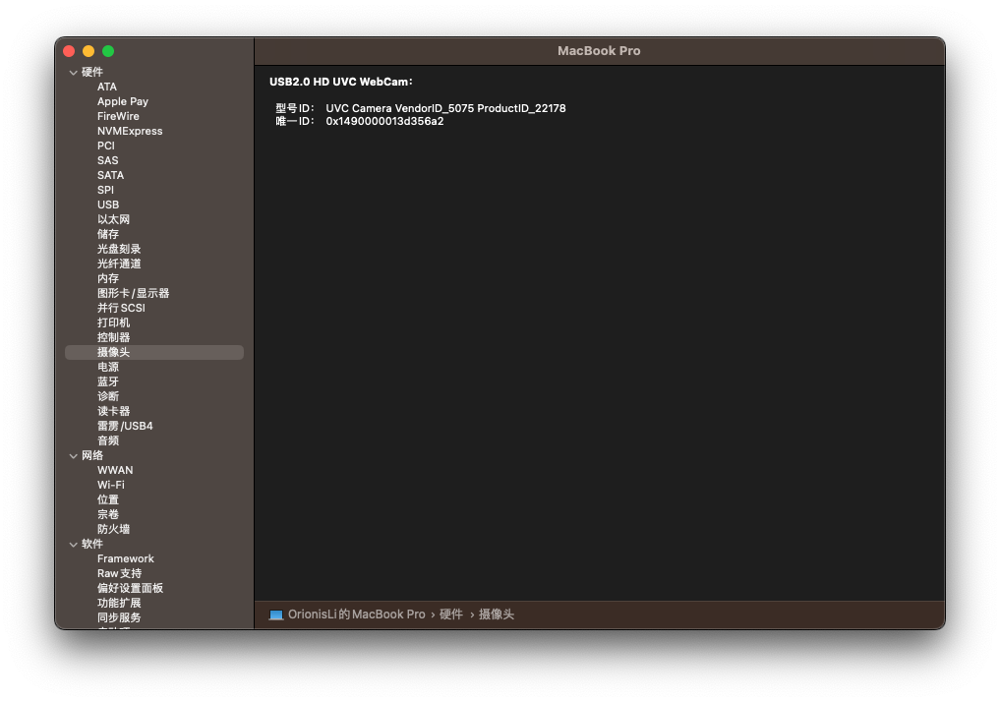

*power:*

*audio:*
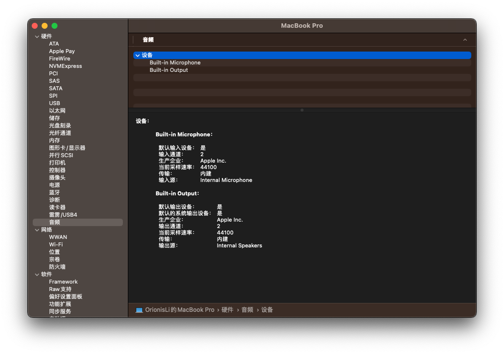

*wifi:*
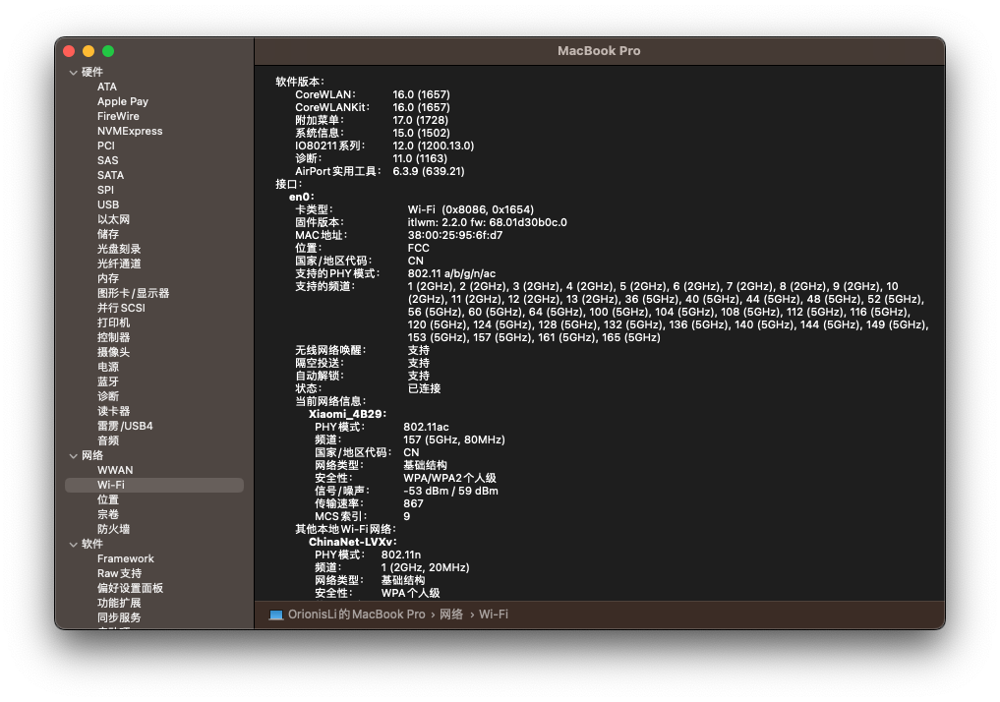

如果帮到了您，您能请我喝瓶矿泉水吗？
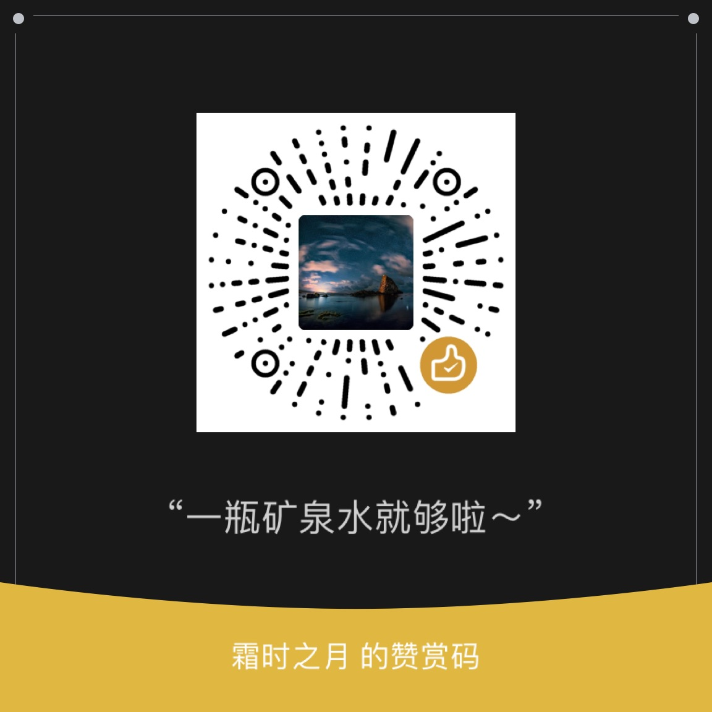

