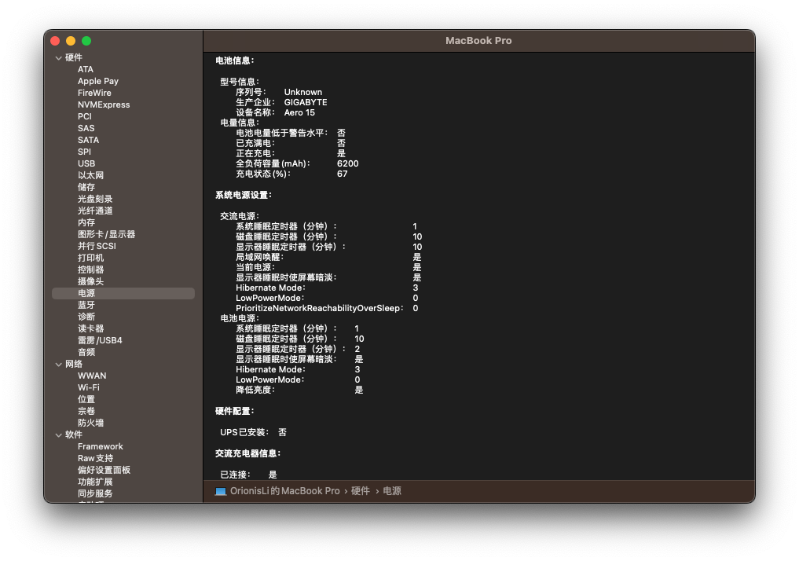

# Hackintosh-Gigabyte-AERO-17SA-Ventura

## OpenCore
使用0.9.9版本即可

## 设备配置
- 型号：Gigabyte AERO-17SA
- 生产日期：2019-08
- CPU：Intel i7-9750H (12) @ 2.60GHz
- GPU1：Intel UHD Graphics 630
- GPU2：NVIDIA GTX 1660Ti (已屏蔽)
- 无线网卡：Intel Killer AX2000
- 有线网卡：？？？
- 存储：INTEL SSDPEKKW512G8

## 目前存在的问题
- 开机3分钟暗屏(添加过 **-igfxblt** 和 **-igfxbls** 参数,无效)
- 蓝牙模块芯片组依旧提示 **THIRD_PARTY_DONGLE** 怀疑蓝牙可以启动但无法连接
- USB接口无法显示但可以读取到U盘信息也可以正常访问(有待考证)
- 雷电接口 **可能** 无法使用
- 和NVIDIA 芯片组相连的一个USB接口和一个雷电接口 **永久** 无法使用(除非你让macos开发者重新支持NVIDIA芯片)
- 似乎不支持指纹识别登录？

## 未测试
- AERO-17SA自带读卡器
- 有线网卡
- 雷电接口

## 奇奇怪怪(不确定)的特性
- 似乎支持升级sonoma？
- Elan触摸板完美支持,可在 **系统设置>触摸板>光标与点按>轻点来点按** 中进行设置从而支持点击
- 似乎支持CPU睿频？
- 摄像头可以使用,但不知道facetime是否支持

## 配图

*neofetch:*

*information:*
 

*hardware:*

*storage:*

*usb:*

*ram:*

*graphics:*

*camera:*

*power:*

*audio:*

*wifi:*

如果帮到了您，您能请我喝瓶矿泉水吗？

